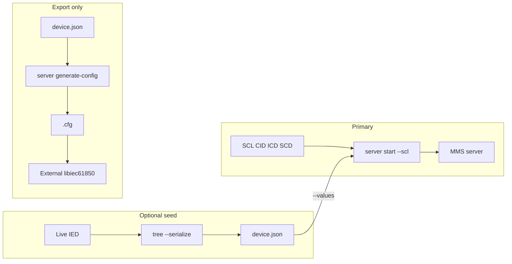

# IEC 61850 MMS server (iec61850ctl)

## Overview

`iec61850ctl server` runs a pure-Go IEC 61850 MMS server using [go-iec61850](https://github.com/otfabric/go-iec61850) and [go-mms](https://github.com/otfabric/go-mms). There is **no CGO** and **no libiec61850** at runtime.

The primary input is **SCL** (ICD / CID / SCD). Optional serialized JSON from `tree --serialize` can seed leaf values. Generating a libiec61850 `.cfg` is **export-only** for external C tooling.

## Quick start

```sh
# First IED in the file
iec61850ctl server start --scl device.cid --host 0.0.0.0 --port 102

# Explicit IED name
iec61850ctl server start --scl device.cid --ied-name MyIED --port 102
```

Stop with Ctrl+C.

### `server start` flags

| Flag | Description |
|------|-------------|
| `--scl` | Path to SCL/CID/ICD (**required**) |
| `--ied-name` | IED in the SCL (default: first IED) |
| `--values` | Optional serialized IED JSON to seed leaves |
| `--host` | Bind address (default `0.0.0.0`) |
| `--port` / `-p` | MMS port (default `102`) |
| `--max-connections` | Reserved for future use (default `5`; not enforced by the current go-mms listener) |

## Value seeding from a live device

```sh
iec61850ctl tree --host 192.0.2.10 --serialize --include all --output device.json
iec61850ctl server start --scl device.cid --values device.json --port 102
```

- **SCL** defines the model structure (`NewServerModelFromSCL`).
- **JSON** best-effort seeds `ValueStore` keys of the form `LD/LN$FC$path`.

### Serialized JSON shape

Produced by `tree --serialize`:

```json
{
  "meta": {
    "source_host": "192.0.2.10",
    "source_port": 102,
    "serialized_at": "2026-07-26T12:00:00Z",
    "generator": "iec61850ctl tree --serialize"
  },
  "logical_devices": [ ],
  "leaves": [ ]
}
```

Use `--include data_sets,report_control_blocks` or `--include all` to attach optional sections. Use `--path` to limit traversal and `--output` to write a file.

## Export-only: `.cfg` for external libiec61850

`server generate-config` writes a text `.cfg` suitable for the **C** libiec61850 server. **iec61850ctl does not load or run `.cfg` files.**

```sh
iec61850ctl tree --host 192.0.2.10 --serialize --output device.json
iec61850ctl server generate-config --input device.json --output server.cfg --name ""
```

| Flag | Description |
|------|-------------|
| `--input` / `-i` | Serialized IED JSON (**required**) |
| `--output` / `-o` | Output `.cfg` path (**required**) |
| `--name` | MODEL name (empty = LD name only as MMS domain) |

## Data flow



## Requirements

- Build: Go **1.24+**, `CGO_ENABLED=0`
- Runtime: no native IEC 61850 libraries
- Binding privileged ports (e.g. 102) may require elevated privileges on some OS setups

See also [PROTOCOL.md](PROTOCOL.md) and [README.md](README.md).
