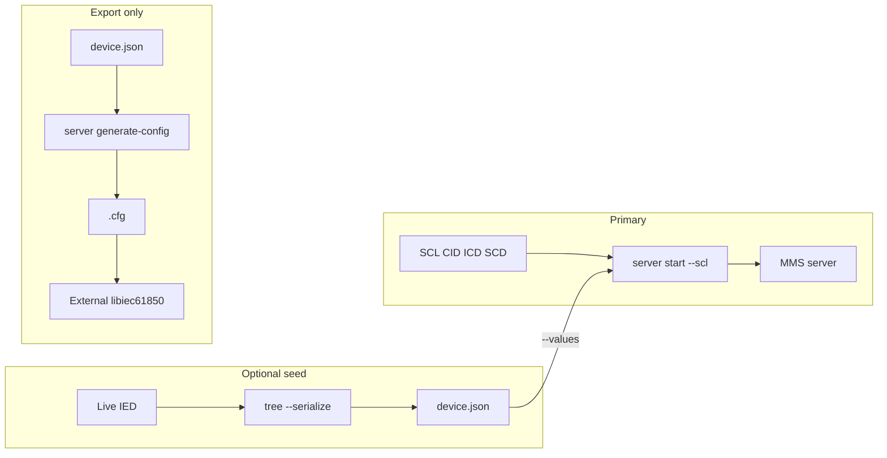

# IEC 61850 MMS server (iec61850ctl)

## Overview

`iec61850ctl server` runs a pure-Go IEC 61850 MMS server using [go-iec61850](https://github.com/otfabric/go-iec61850) and [go-mms](https://github.com/otfabric/go-mms). There is **no CGO** and **no libiec61850** at runtime.

The primary input is **SCL** (ICD / CID / SCD). Optional serialized JSON from `tree --serialize` can seed leaf values. Generating a libiec61850 `.cfg` is **export-only** for external C tooling.

## Quick start

```sh
# First IED in the file
iec61850ctl server start --scl device.cid --host 0.0.0.0 --port 102

# Explicit IED name
iec61850ctl server start --scl device.cid --ied-name MyIED --port 102
```

Stop with Ctrl+C.

### `server start` flags

| Flag | Description |
|------|-------------|
| `--scl` | Path to SCL/CID/ICD (**required**) |
| `--ied-name` | IED in the SCL (default: first IED) |
| `--values` | Optional serialized IED JSON to seed leaves |
| `--host` | Bind address (default `0.0.0.0`) |
| `--port` / `-p` | MMS port (default `102`) |
| `--max-connections` | Reserved for future use (default `5`; not enforced by the current go-mms listener) |
| `--ready-json` | After bind, emit one readiness JSON line on **stdout** |
| `--fixture-id` | Fixture revision string included in the readiness event (e.g. `iec61850-v2`) |

### Structured readiness (`--ready-json`)

When `--ready-json` is set, the server writes exactly one JSON line to **stdout** after the listener is bound. The human “listening on …” message always goes to **stderr**.

```json
{"event":"ready","address":"0.0.0.0:1102","fixture":"iec61850-v2","adapter":"iec61850ctl","version":"<build>","ied_name":"InteropIED"}
```

| Field | Meaning |
|-------|---------|
| `event` | Always `ready` |
| `address` | Bind address as `host:port` |
| `fixture` | Present when `--fixture-id` was set |
| `adapter` | Always `iec61850ctl` |
| `version` | Build/version string from the CLI |
| `ied_name` | Selected IED name |

Automation should parse stdout as a single readiness document, then connect clients to the published address. Stop the process with SIGTERM (Ctrl+C); tests force-kill only after a bounded wait.

### Docker-to-host clients

External mms-interop adapters often run in Docker and reach a host-bound CLI server:

```sh
iec61850ctl server start \
  --scl e2e/testdata/interop.icd \
  --values e2e/testdata/self-server-values.json \
  --ied-name InteropIED --fixture-id iec61850-v2 \
  --host 0.0.0.0 --port 1102 --ready-json

docker run --rm --add-host=host.docker.internal:host-gateway \
  --entrypoint libiec61850-ied-controller \
  mms-interop-libiec61850:local \
  --host host.docker.internal --port 1102 --do SPCSO1 --ctlval 1
```

### Reverse interoperability coverage

Black-box e2e (Phase 3A) drives mms-interop **controller** and **reporter** adapters against `server start`:

- Controllers: direct (`SPCSO1`), SBO (`SPCSO2`), SBOw (`SPCSO3`)
- Reporters: URCB data-change (enable → write → report → disable → conclude)

See [INTEROP.md](INTEROP.md). General external browse/read (Phase 3B) is deferred until generic reader adapters exist in mms-interop capabilities.

### Interop control registration

Every `server start` registers handlers for the mms-interop controllable objects on **`InteropLD`**:

| DO | ctlModel |
|----|----------|
| `GGIO1.SPCSO1` | direct-with-normal-security |
| `GGIO1.SPCSO2` | sbo-with-normal-security |
| `GGIO1.SPCSO3` | sbo-with-enhanced-security |

Operate updates the matching `stVal` in the value store. Registration is unconditional; for SCLs without those objects the handlers are inert (SBO install may warn). They are required for Phase 3A reverse controller e2e.

## Value seeding from a live device

```sh
iec61850ctl tree --host 192.0.2.10 --serialize --include all --output device.json
iec61850ctl server start --scl device.cid --values device.json --port 102
```

- **SCL** defines the model structure (`NewServerModelFromSCL`).
- **JSON** best-effort seeds `ValueStore` keys of the form `LD/LN$FC$path`.

### Serialized JSON shape

Produced by `tree --serialize`. Field names are **PascalCase** (Go `encoding/json` defaults on `domain.IED` — there are no snake_case tags):

```json
{
  "Meta": {
    "SourceHost": "192.0.2.10",
    "SourcePort": 102,
    "SerializedAt": "2026-07-26T12:00:00Z",
    "Generator": "iec61850ctl tree --serialize"
  },
  "LogicalDevices": [],
  "Leaves": [
    {
      "Ref": "InteropLD/GGIO1.SPS1.stVal",
      "FC": "ST",
      "Type": "BOOL",
      "Value": { "Raw": false, "Type": "BOOL" }
    }
  ]
}
```

`server start --values` expects this shape (see `e2e/testdata/self-server-values.json`). Use `--include data_sets,report_control_blocks` or `--include all` to attach optional sections on serialize. Use `--path` to limit traversal and `--output` to write a file.

## Export-only: `.cfg` for external libiec61850

`server generate-config` writes a text `.cfg` suitable for the **C** libiec61850 server. **iec61850ctl does not load or run `.cfg` files.**

```sh
iec61850ctl tree --host 192.0.2.10 --serialize --output device.json
iec61850ctl server generate-config --input device.json --output server.cfg --name ""
```

| Flag | Description |
|------|-------------|
| `--input` / `-i` | Serialized IED JSON (**required**) |
| `--output` / `-o` | Output `.cfg` path (**required**) |
| `--name` | MODEL name (empty = LD name only as MMS domain) |

## Data flow



## Requirements

- Build: Go **1.24+**, `CGO_ENABLED=0`
- Runtime: no native IEC 61850 libraries
- Binding privileged ports (e.g. 102) may require elevated privileges on some OS setups

See also [PROTOCOL.md](PROTOCOL.md) and [../README.md](../README.md).
